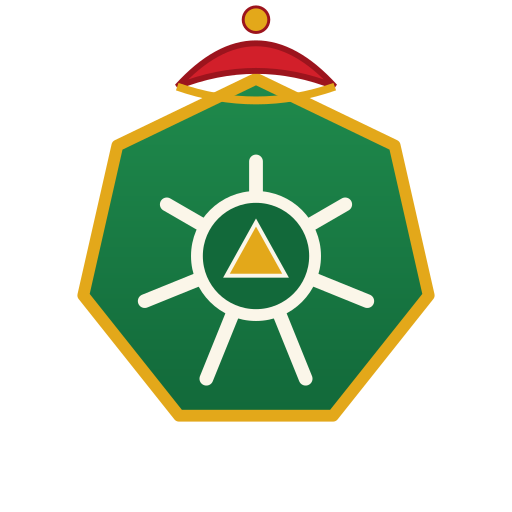

<div align="center">



# Татарнетес / Tatarnetes

**Милли контейнер оркестраторы · A national container orchestrator**

*kubectl һәм Kubernetes өстендәге татарча кабык — түбәтәйле, чәкчәкле, Тукайлы.*
*A Tatar-flavoured shell over kubectl & Kubernetes — with skullcaps, chäkchäk, and Tukay.*

[](LICENSE)
[](LICENSE)
[](lib/teatime.sh)

[Татарча](#татарча) · [English](#english) · [Сүзлек / Dictionary](docs/commands.md)

</div>

---

## Татарча

**Татарнетес** — Kubernetes'ның милли варианты. Ул синең гадәти `kubectl`
өстеннән эшли, ләкин барлык әмерләрне татарча кабул итә, статус-хәбәрләрне
татарчага тәрҗемә итә, һәм һәр адымда сине түбәтәйле йөз, чәкчәк-кыстыбый
һәм Габдулла Тукай юллары белән каршы ала.

> «И туган тел, и матур тел, әткәм-әнкәмнең теле!» — Г. Тукай

### Ни өчен?

- **Татарча әмерләр** — `ayda күрсәт кузаклар` дип язасың, ул `kubectl get pods`
  дип башкара. Гадәти `kubectl` әмерләре дә эшли.
- **Милли асыл атамалары** — под = **кузак**, node = **төен**, service = **хезмәт**,
  namespace = **мәйдан**, ingress = **капка**, secret = **сер**, volume = **күләм**.
- **Җанлы чыгарылыш** — уңышта шат түбәтәйле йөз Татарстанны мактый; хатада —
  ачулы йөз һәм йомшак татар шелтәсе. Арада — Тукай шигырьләре һәм ризыклар.
- **Чәй тәнәфесе** — көненә берничә тапкыр кластер сөтле чәйгә һәм кыстыбыйга
  туктый. Ул вакытта кермә — безгә дә чәй эчәргә кирәк! 🍵
- **Идарә панеле (UI)** — татар келәме фонында, милли төсләрдә.

### Урнаштыру

```bash
git clone https://github.com/tatar-ncf/tatarnetes.git
cd tatarnetes
./install.sh        # ~/.local/bin/ayda символик сылтамасын ясый
# яки кулдан:
export PATH="$PWD/bin:$PATH"
```

Кирәк: `bash` һәм эшләп торган `kubectl` (Татарнетес аны эчтән чакыра).

### Куллану

```bash
ayda күрсәт кузаклар            # kubectl get pods
ayda күрсәт кузаклар -A         # kubectl get pods -A
ayda сөйлә төен tatar-node-1    # kubectl describe node tatar-node-1
ayda көндәлек my-pod            # kubectl logs my-pod
ayda бетер хезмәт my-svc        # kubectl delete svc my-svc
ayda күрсәт барысы -A           # kubectl get all -A

ayda ярдәм                      # ярдәм
ayda сүзлек                     # тулы сүзлек
ayda тукай                      # Тукайдан бер шигырь
ayda чәй                        # чәй тәнәфесе графигы
```

Гадәти `kubectl` синтаксисы да кабул ителә: `ayda get pods`.

### Милли-нативлык (тирән мөмкинлекләр)

- **Тел сайлау** — `AYDA_LANG=tt|en`. Интерфейс юллары [`locale/*.po`](locale/) да
  (gettext) — носителеләр PR аша тәрҗемә итә ала, кодка тимичә.
- **Өч язу** — `AYDA_ALIF=cyrl|latin|arab`: кирилл, **Яңалиф** (латин), **Яңа имля**
  (татар гарәп язуы, 1920нче еллар — фонематик, сүз башы сузыгына hamza ташучысы,
  RTL+тоташу терминалда). `ayda kürsät kuzaklar` — латинча керем дә эшли.
- **Милли терминология** — [docs/terminology.tt.md](docs/terminology.tt.md):
  Kubernetes төшенчәләренә татарча IT-сүзлек (реаль өлеш, пародия түгел).
- **Классик поэзия** — Тукай, Җәлил, Дәрдмәнд, Сибгат Хәким + халык мәкальләре;
  барысы да чыганак буенча тикшерелгән ([data/](data/), [VERIFICATION](data/VERIFICATION.tt.md)).
  `ayda шигырь`, `ayda мәкаль`.
- **Хата тәрҗемәсе** — kubectl хатасы (NotFound, Forbidden, timeout…) татарча киңәш белән.
- **Хуҗалыкчыллык** — артык реплика (`--replicas=50`) соралса: «Акчаны әрәм итмә!».
- **Кунакчыллык** — яңа контекстка (төбәк) беренче тапкыр кергәндә каршы ала.
- **Календарь** — җомга, Нәүрүз, Сабантуй, байрам көннәрендә бәйрәм баннеры.
- **krew плагины** — `kubectl ayda ...` (кара [plugins/ayda.yaml](plugins/ayda.yaml)).

### Көйләмәләр (environment)

| Үзгәрешле | Мәгънәсе |
|---|---|
| `AYDA_LANG=tt\|en` | интерфейс теле (default: `tt`) |
| `AYDA_ALIF=cyrl\|latin\|arab` | язу төре (кирилл/яңалиф/яңа имля) |
| `AYDA_KUBECTL=<юл>` | kubectl юлы (default: `kubectl`) |
| `AYDA_NO_TEA=1` | чәй тәнәфесен узып китү |
| `AYDA_FORCE_TEA=1` | чәй экранын мәҗбүри күрсәтү (демо/тест) |
| `AYDA_FINOPS_MAX=<сан>` | реплика чиге (default 10) |
| `AYDA_PLAIN=1` | бизәксез, төссез (скрипт өчен) |
| `AYDA_QUIET=1` | бизәкләрне сүндерү |
| `AYDA_FORCE_FUN=1` | торбада (pipe) да бизәк күрсәтү |
| `NO_COLOR=1` | төссез |

> Бизәкләр `stderr`'га чыга, шуңа `ayda күрсәт кузаклар -o json | jq` чиста эшли.

### Идарә панеле (UI)

Милли идарә панеле — аерым репозиторийда:
[**tatar-ncf/tatarnetes-ui**](https://github.com/tatar-ncf/tatarnetes-ui).
Татар келәме фонында, милли төсләрдә; чәй тәнәфесендә ул да ябыла.

---

## English

**Tatarnetes** is the national edition of Kubernetes. It runs on top of your
ordinary `kubectl`, but accepts every command in Tatar, translates status
messages into Tatar, and greets you at every step with a skullcap-wearing face,
Tatar dishes, and lines of the classic poet Gabdulla Tukay.

### Why?

- **Tatar commands** — you type `ayda күрсәт кузаклар`, it runs `kubectl get pods`.
  Plain `kubectl` commands work too.
- **National resource names** — pod = **кузак** (pea pod), node = **төен** (knot),
  service = **хезмәт**, namespace = **мәйдан**, ingress = **капка** (gate),
  secret = **сер**, volume = **күләм**.
- **Living output** — on success a happy skullcap face praises Tatarstan; on error
  an angry face and a gentle Tatar scolding. In between: Tukay verses and dishes.
- **Tea breaks** — several times a day the cluster stops for tea-with-milk and
  kыstybyй. Don't knock then — let us drink our tea! 🍵
- **Dashboard (UI)** — on a Tatar-carpet background, in national colours.

### Install

```bash
git clone https://github.com/tatar-ncf/tatarnetes.git
cd tatarnetes && ./install.sh
# or: export PATH="$PWD/bin:$PATH"
```

Requires `bash` and a working `kubectl` (Tatarnetes calls it under the hood).

### Usage

```bash
ayda күрсәт кузаклар      # kubectl get pods
ayda get pods            # also works (plain kubectl passthrough)
ayda ярдәм               # help
ayda сүзлек              # full dictionary
```

See the full command map in **[docs/commands.md](docs/commands.md)** and the
architecture in **[docs/architecture.md](docs/architecture.md)**.

---

## Гаилә / Family

| Проект | Ни ул | Repo |
|---|---|---|
| 🐘 **Татарнетес** | Милли Kubernetes (бу репо) | `tatar-ncf/tatarnetes` |
| 🖥 **Татарнетес UI** | Милли идарә панеле | `tatar-ncf/tatarnetes-ui` |
| 🐧 **TatarOS Linux** | Милли Talos — Татарнетес йөртүче ОС | `tatar-ncf/tataros` |

Барысы да [**Tatar-Native Computing Foundation**](https://github.com/tatar-ncf)
кул астында.

## Лицензия / License

[**Tatarch License 2.0**](LICENSE) — Apache 2.0 нигезендә, ләкин эпик тел белән.
Бу җимеш рухи яктан **бөтен бөек татар халкына** нисбәтле.

This Work belongs, in spirit, to the **great Tatar people**.

<div align="center">

**Рәхмәт яугыры! Татарстан алга! Яшә, ирекле код!** 🟢⚪🔴

</div>
